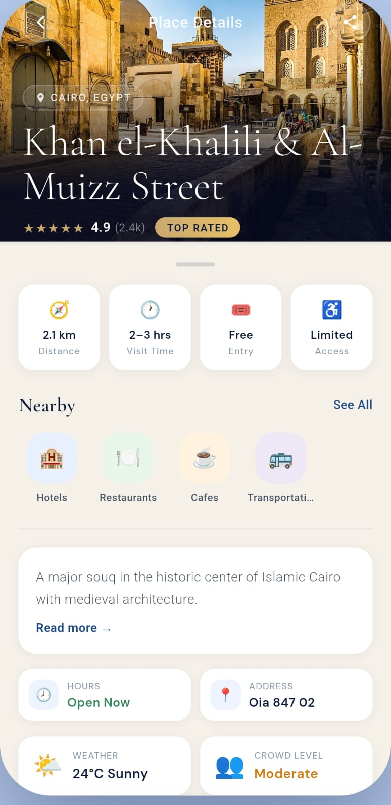
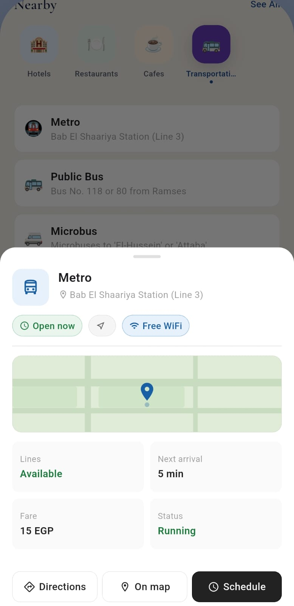

# 🌍 Globe Go

Globe Go is an AI-powered tourism application built with Flutter that helps tourists discover attractions across Egypt, receive personalized travel recommendations, and generate optimized travel plans based on their preferences.

## ✨ Features

- 🔐 Authentication using Supabase
- 🤖 AI-powered trip recommendations
- 🗺️ Explore Egyptian governorates and tourist attractions
- 📅 Personalized travel planning
- ❤️ Save favorite places
- 📱 Modern and responsive Flutter UI
- ⚡ Fast navigation with GoRouter
- 💾 Image caching for better performance
- 🌐 REST API integration
- 🧠 Clean Architecture with BLoC State Management

---

## 📱 Screenshots

<p align="center">
  
  

</p>

<p align="center">
  
  
</p>

<p align="center">
  
  
</p>

<p align="center">
  
  
  
</p>

<p align="center">
  
  
  

</p>

## 🛠 Tech Stack

### Mobile
- Flutter
- Dart

### State Management
- flutter_bloc

### Routing
- GoRouter

### Backend
- Supabase

### Networking
- Dio
- HTTP

### Dependency Injection
- GetIt

### Other Packages

- Cached Network Image
- Flutter Cache Manager
- Flutter ScreenUtil
- Convex Bottom Bar
- Awesome Dialog
- Pin Code Fields
- Intl

---

## 📂 Project Structure

```
lib
│
├── core
│   ├── constants
│   ├── helpers
│   ├── routing
│   ├── services
│   └── widgets
│
├── features
│   ├── auth
│   ├── home
│   ├── ai_trip
│   ├── favorites
│   ├── profile
│   └── onboarding
│
└── main.dart
```

---

## 🚀 Getting Started

### Clone Repository

```bash
git clone https://github.com/bayomi-bit/globe_go.git
```

### Install Packages

```bash
flutter pub get
```

### Run App

```bash
flutter run
```

---

## 📦 Main Dependencies

| Package | Purpose |
|----------|----------|
| flutter_bloc | State Management |
| supabase_flutter | Authentication & Database |
| dio | Networking |
| http | API Requests |
| google_generative_ai | AI Recommendations |
| openai_dart | AI Integration |
| cached_network_image | Image Caching |
| flutter_cache_manager | Cache Management |
| get_it | Dependency Injection |
| go_router | Routing |
| flutter_screenutil | Responsive UI |

---

## 🤖 AI Features

The application uses Generative AI to:

- Recommend tourist destinations
- Generate personalized travel plans
- Suggest attractions based on user interests
- Optimize trip schedules

---

## 📸 Screens

- Splash Screen
- Onboarding
- Login
- Register
- OTP Verification
- Home
- Governorates
- Attraction Details
- AI Trip Planner
- Favorites
- Profile

---

## 📈 Future Improvements

- Offline Mode
- Hotel Recommendation
- Flight Integration
- Weather Forecast
- Maps Navigation
- Multi-language Support
- Payment Gateway

---

## 👨‍💻 Author

**Mahmoud Bayoumi**

- LinkedIn: https://linkedin.com/in/mahmoud-bayoumi-44b22b28a
- GitHub: https://github.com/bayomi-bit

---

## ⭐ Support

If you like this project, consider giving it a ⭐ on GitHub.
